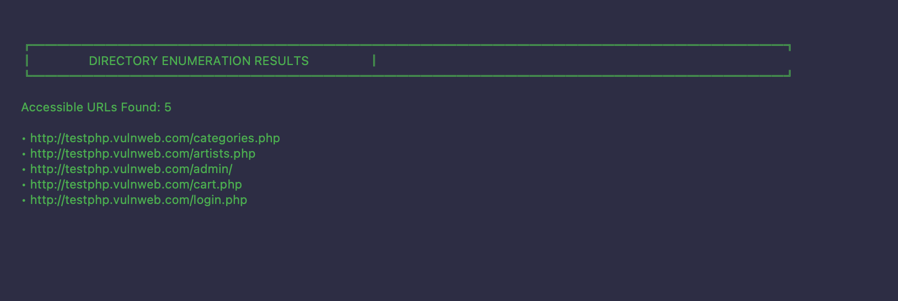
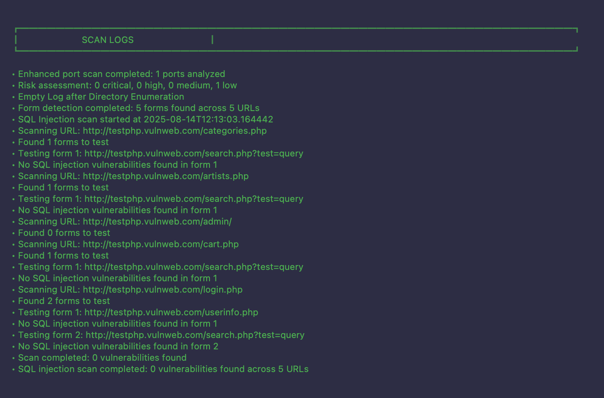
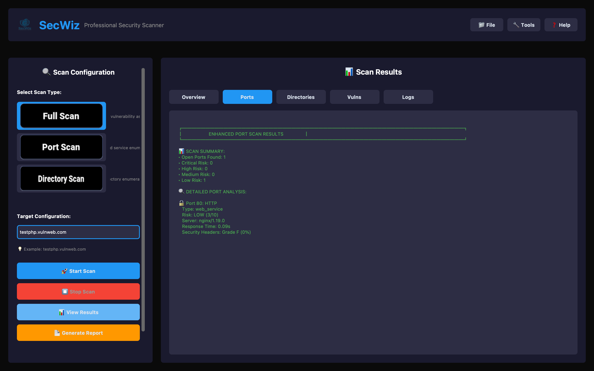

<div align="center">
  
  <h1>SecWiz - Professional Security Scanner</h1>
  <p>A comprehensive web security scanning tool with a modern GUI interface, developed by Revant and Mansour.</p>
  
  [](https://www.python.org/downloads/)
  [](LICENSE)
  [](https://github.com/yourusername/SecWiz)
  [](https://github.com/TomSchimansky/CustomTkinter)
</div>

## 🚀 Features

### 🔍 Security Scanning
- **Port Scanning**: Comprehensive port enumeration with service detection
- **Directory Enumeration**: Web directory and file discovery using Gobuster
- **Form Analysis**: Automatic form input extraction and analysis
- **SQL Injection Testing**: Automated SQL injection vulnerability assessment
- **Full Vulnerability Assessment**: Complete security audit workflow

### 🎨 Modern GUI Interface
- **Professional Design**: Dark theme with blue accents, inspired by Burp Suite
- **Multi-Panel Layout**: Configuration panel and results display
- **Dynamic Tabs**: Different result views based on scan type
- **Real-time Updates**: Live progress and status updates
- **Asset Integration**: Custom logos and button images

## 📸 Screenshots

### Main Interface


*Professional dark-themed interface with scan configuration panel and results display*

### Port Scan Results


*Detailed port analysis showing open ports, services, and security assessments*

### Full Scan Overview


*Comprehensive scan results with risk assessment and vulnerability findings*

### Application Features
- **Responsive Design**: Adapts to different screen sizes and resolutions
- **Professional UI**: Dark theme with blue accents for optimal visibility
- **Real-time Updates**: Live progress tracking during scans
- **Comprehensive Results**: Detailed analysis with risk assessments

## 📁 Project Structure

```
SecWiz/
├── gui/                          # GUI package
│   ├── __init__.py              # Package initialization
│   ├── gui.py                   # Main GUI interface
│   ├── backend_integration.py   # Backend integration layer
│   └── README.md               # GUI documentation
├── tools/                       # Backend scanner tools
│   ├── portScanner.py          # Port scanning logic
│   ├── gobuster_scan.py        # Directory enumeration
│   ├── sqlScanner.py           # SQL injection testing
│   ├── parmScanner.py          # Form input extraction
│   └── utils.py                # Utility functions
├── config/                      # Configuration files
├── assets/                      # GUI assets (logos, buttons)
├── screenshots/                 # Application screenshots
├── resources/                   # Scan resources and wordlists
├── ExternalTools/               # External security tools (sqlmap)
├── main.py                     # Application entry point
├── requirements.txt             # Project dependencies
├── test_integration.py         # Integration test suite
├── LICENSE                     # MIT License
└── .gitignore                  # Git ignore rules
```

## 🚀 Quick Start

```bash
# Clone and setup
git clone <repository-url>
cd SecWiz
python3 -m venv venv
source venv/bin/activate  # On Windows: venv\Scripts\activate
pip install -r requirements.txt

# Run the application
python main.py
```

## 🛠️ Installation

### Prerequisites
- Python 3.8+
- Virtual environment (recommended)
- External tools: `gobuster`, `sqlmap`

### Setup
```bash
# Clone the repository
git clone <repository-url>
cd SecWiz

# Create and activate virtual environment
python3 -m venv venv
source venv/bin/activate  # On Windows: venv\Scripts\activate

# Install dependencies
pip install -r requirements.txt

# Install external tools (if not already installed)
# gobuster: https://github.com/OJ/gobuster
# sqlmap: https://github.com/sqlmapproject/sqlmap
```

## 🎯 Usage

### Running the GUI
```bash
# Activate virtual environment
source venv/bin/activate

# Start the application
python main.py
```

### Testing Integration
```bash
# Run the test suite
python test_integration.py
```

## 🔧 Scan Types

### Full Scan
Complete vulnerability assessment including:
- Port scanning and service detection
- Directory enumeration
- Form input analysis
- SQL injection testing

### Port Scan
Focused port analysis:
- All ports (open and closed)
- Open ports with running services
- Service identification

### Directory Scan
Web enumeration:
- All discovered files and directories
- Accessible files (status 200/301)
- Protected files requiring authentication

## 🎨 GUI Features

### Professional Interface
- **Dark Theme**: Easy on the eyes for extended use
- **Blue Accents**: Professional color scheme
- **Multi-Panel Layout**: Efficient workspace organization
- **Dynamic Tabs**: Context-aware result display

### User Experience
- **Real-time Progress**: Live status updates during scans
- **Non-blocking Operations**: GUI remains responsive during scans
- **Error Handling**: Comprehensive error reporting
- **Result Export**: Save scan results to files

## 🔄 Integration Architecture

The application uses a clean separation of concerns:

1. **GUI Layer** (`gui/gui.py`): User interface and interaction
2. **Integration Layer** (`gui/backend_integration.py`): Bridge between GUI and tools
3. **Tool Layer** (`tools/`): Individual scanner tools
4. **Configuration** (`config/`): Settings and wordlists

## 📊 Testing

The project includes comprehensive testing:
- **Integration Tests**: Verify GUI-backend connectivity
- **Import Tests**: Ensure all modules load correctly
- **GUI Tests**: Validate interface creation and functionality

## 🛡️ Security Notes

- **Ethical Use**: Only scan systems you own or have permission to test
- **Legal Compliance**: Ensure compliance with local laws and regulations
- **Responsible Disclosure**: Report vulnerabilities through proper channels

## 🤝 Contributing

1. Fork the repository
2. Create a feature branch
3. Make your changes
4. Add tests for new functionality
5. Submit a pull request

## 📝 License

This project is developed by Revant and Mansour for educational and ethical security testing purposes.

## 🆘 Support

For issues and questions:
- Check the documentation in `gui/README.md`
- Run the test suite: `python test_integration.py`
- Verify external tools are properly installed

## 🎯 Roadmap

- [ ] Enhanced error handling and reporting
- [ ] Progress bars and visual indicators
- [ ] PDF and HTML report generation
- [ ] Configuration management system
- [ ] Plugin architecture for extensibility
- [ ] Additional vulnerability scanners
